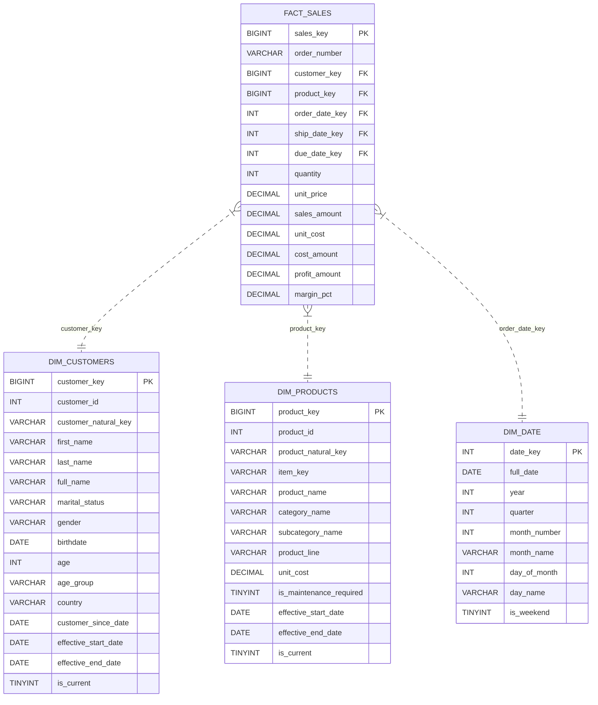
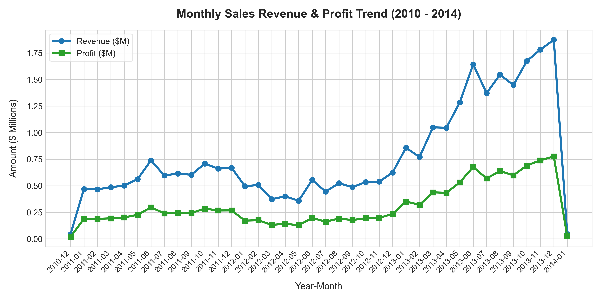
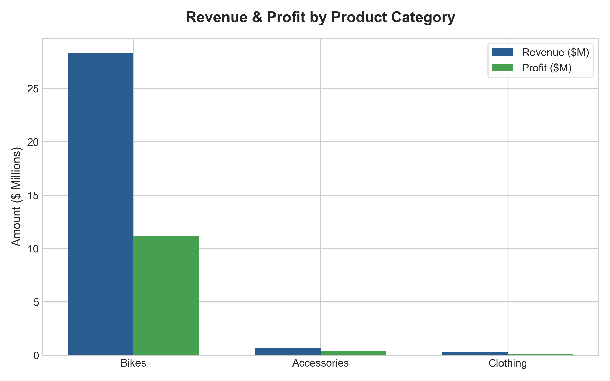
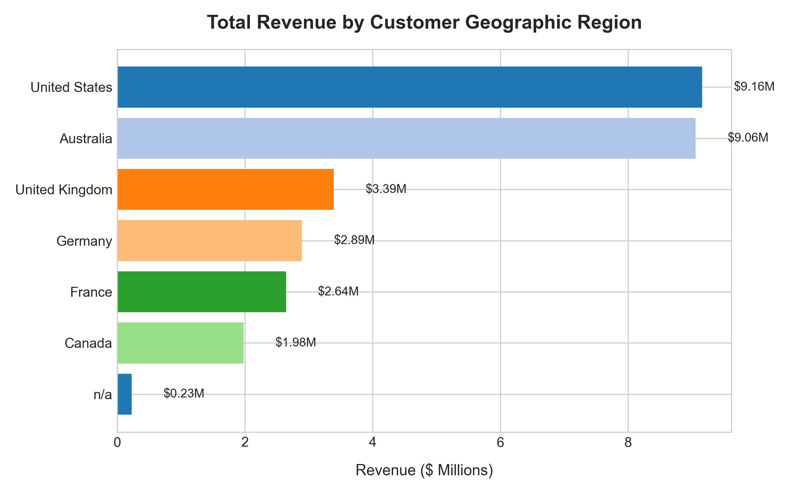

# Global Retail Data Modelling

[](https://www.python.org/)
[](https://www.mysql.com/)
[](https://en.wikipedia.org/wiki/ANSI_SQL)
[](https://docs.pytest.org/)
[-purple.svg)](#architecture-overview)

> An end-to-end Enterprise Data Engineering & Data Modeling solution transforming fragmented CRM and ERP transactional datasets into an analytics-ready Star Schema using the Medallion Architecture, MySQL SQL transformations, Slowly Changing Dimension (SCD Type 2) version tracking, automated data quality testing, and analytical visualization reporting.

---

## Executive Summary & Business Problem

A global retail enterprise operates across disjointed CRM and ERP platforms, resulting in fragmented data silos, unstandardized categorical values (e.g., inconsistent gender and country codes), calculation errors in raw sales figures, and lack of historical attribute tracking. 

This project delivers a centralized **MySQL Data Warehouse** platform that:
- Ingests raw sales, customer, and product records from multiple source systems into **01_Bronze** tables.
- Cleanses, standardizes, and preserves historical customer version records in **02_Silver** tables.
- Builds conformed calendar dimensions in **03_Gold**.
- Executes dedicated **04_SCD_Type2** processing for customer demographic updates and product version management.
- Loads **03_Gold Fact Table (`fact_sales`)** AFTER final SCD dimension surrogate keys and effective date ranges exist.
- Runs **05_Analytics** (19 comprehensive business queries) and **06_Testing** (SQL data quality & referential integrity validation).

---

## Grain of Fact Table & Integration Business Rules

> [!IMPORTANT]
> **Grain of `fact_sales`**: **One row per sales order line/product transaction.**

### Key Integration Rules:
1. **Product Integration Key**: `sls_prd_key` in sales details (e.g. `BK-R93R-62`) connects to `gold.dim_products` via `item_key` (the product item key suffix extracted from CRM `prd_key` `BI-RB-BK-R93R-62`). `product_natural_key` retains the full source system string (`BI-RB-BK-R93R-62`).
2. **Customer SCD Type 2 Business Rule**: `cst_create_date` is used as the customer version effective date for tracking customer attribute changes over time.

---

## Architecture & Sequential Pipeline Execution Order

To guarantee 100% referential integrity and zero orphan keys, the pipeline executes in the following strict sequential order:

```
+-----------------------------------------------------------------------------------+
| 01_BRONZE LAYER (Raw Ingestion)                                                   |
| Ingests raw CRM & ERP datasets into immutable tables preserving exact strings.     |
+-----------------------------------------------------------------------------------+
                                         |
                                         v
+-----------------------------------------------------------------------------------+
| 02_SILVER LAYER (Cleansing & History Retention)                                   |
| Standardizes values and retains historical customer version creation records.     |
+-----------------------------------------------------------------------------------+
                                         |
                                         v
+-----------------------------------------------------------------------------------+
| 03_GOLD BASE DIMENSIONS (Calendar Dimension)                                      |
| Builds gold.dim_date calendar table.                                              |
+-----------------------------------------------------------------------------------+
                                         |
                                         v
+-----------------------------------------------------------------------------------+
| 04_SCD_TYPE2 DIMENSIONS (Slowly Changing Dimensions)                               |
| Generates gold.dim_customers & gold.dim_products with final surrogate keys & dates|
+-----------------------------------------------------------------------------------+
                                         |
                                         v
+-----------------------------------------------------------------------------------+
| 03_GOLD FACT TABLE (fact_sales Load)                                              |
| Builds fact_sales using point-in-time joins on finalized dimension surrogate keys |
+-----------------------------------------------------------------------------------+
                                         |
                                         v
+-----------------------------------------------------------------------------------+
| 05_ANALYTICS LAYER (Business Queries & Analytics Suite)                           |
| Executes 19 analytical queries across revenue, customer behavior, and products.  |
+-----------------------------------------------------------------------------------+
                                         |
                                         v
+-----------------------------------------------------------------------------------+
| 06_TESTING LAYER (Data Quality & Referential Integrity Suite)                      |
| Asserts 0 orphan customer keys, 0 orphan product keys, and key uniqueness.       |
+-----------------------------------------------------------------------------------+
```

---

## Dimensional Model (Star Schema ERD)



---

## Executive Analytical Insights & Visualizations

### 1. Monthly Revenue & Profit Trends


### 2. Revenue & Profit by Product Category


### 3. Customer Geographic Revenue Distribution


---

## Repository Directory Structure

```
├── README.md                            # Executive Documentation & Setup Guide
├── requirements.txt                     # Python Dependencies (MySQL Connector, PyMySQL, Pandas, Matplotlib, Pytest)
├── .gitignore                           # Git ignore configurations
├── config/
│   └── settings.py                      # Global path & MySQL database settings
├── data/
│   └── raw/                             # Raw Input CRM & ERP Datasets
│       ├── source_crm/                  # cust_info.csv, prd_info.csv, sales_details.csv
│       └── source_erp/                  # CUST_AZ12.csv, LOC_A101.csv, PX_CAT_G1V2.csv
├── docs/
│   ├── data_architecture.md             # Architectural & lineage specifications
│   ├── data_dictionary.md               # Complete field-level data dictionary
│   └── er_diagram.mermaid               # Star Schema ERD source file
├── scripts/
│   ├── build_zip.py                     # Packaging script for ZIP distribution
│   ├── run_pipeline.py                  # Master Pipeline Orchestrator (Stages 01 through 06)
│   └── test_data_quality.py             # Data Quality & Integrity Test Suite (pytest)
├── sql/
│   ├── 01_bronze/                       # Stage 01: Raw Ingestion DDL (01 to 06)
│   ├── 02_silver/                       # Stage 02: Cleansing & History Retention (01 to 06)
│   ├── 03_gold/                         # Stage 03: Base Dimensions & Fact Table (01 to 04)
│   ├── 04_scd_type2/                    # Stage 04: Dedicated SCD Type 2 Dimensions (01 & 02)
│   ├── 05_analytics/                    # Stage 05: Business Analytics Queries (01 to 04: 19 Queries)
│   └── 06_testing/                      # Stage 06: SQL Data Quality & Integrity Tests (01 to 03)
└── visualizations/
    ├── generate_charts.py               # Automated chart rendering script
    ├── sales_trend.png                  # Monthly sales revenue & profit trend plot
    ├── revenue_by_category.png          # Product category bar chart
    └── customer_demographics.png        # Regional spend horizontal bar chart
```

---

## Quickstart & Execution Guide

### 1. Installation & Environment Setup

Clone the repository and install required dependencies:
```bash
git clone https://github.com/your-username/global-retail-data-modelling.git
cd global-retail-data-modelling
pip install -r requirements.txt
```

### 2. Configure MySQL Connection (Optional)

By default, the pipeline connects to local MySQL (`localhost:3306`, user `root`, pass ``). You can set environment variables for your MySQL instance:

```bash
export MYSQL_HOST=localhost
export MYSQL_PORT=3306
export MYSQL_USER=root
export MYSQL_PASSWORD=yourpassword
export MYSQL_DATABASE=global_retail_dw
```

### 3. Run 6-Stage Data Pipeline

Execute the full pipeline across stages `01_bronze` through `06_testing`:
```bash
python scripts/run_pipeline.py
```

### 4. Run Pytest Quality Suite

Assert key uniqueness, SCD date bounds, non-null constraints, and referential integrity:
```bash
pytest scripts/test_data_quality.py
```

### 5. Render Visualizations & Build ZIP

Generate analytical charts and package clean ZIP distribution archive:
```bash
python visualizations/generate_charts.py
python scripts/build_zip.py
```

---

## License

This project is open-source under the [MIT License](LICENSE).
