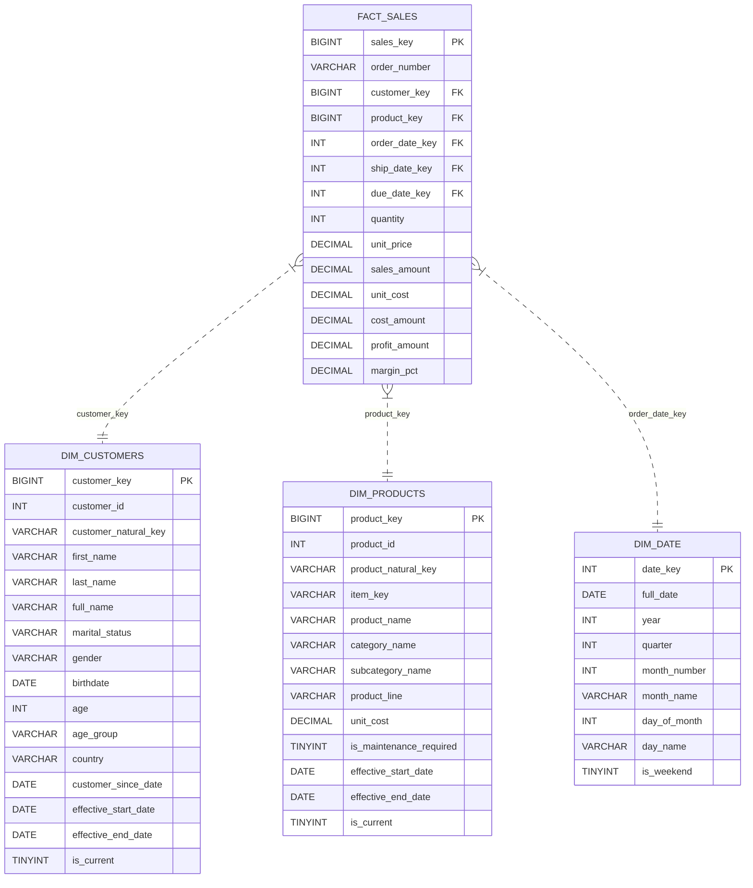

# Global Retail Data Modelling - Architecture & Engineering Guide

This document details the architectural design, data modeling methodology, and transformation engineering implemented in this Enterprise MySQL Data Engineering solution.

---

## 1. Architectural Overview

The platform uses the **Medallion Architecture** built on **MySQL 8.0+**, organizing data into six sequential logical transformation stages (`01` to `06`):

```
                  +-----------------------------------+
                  |        Source Data Systems        |
                  |     (CRM CSVs & ERP Datasets)     |
                  +-----------------------------------+
                                    |
                                    v
+-----------------------------------------------------------------------+
|  01_BRONZE LAYER (Raw MySQL Ingestion)                                |
|  - Immutable raw table ingestion                                      |
|  - Preserves exact source string formatting & schema                  |
|  - Adds `_ingested_at` audit metadata timestamp                       |
+-----------------------------------------------------------------------+
                                    |
                                    v
+-----------------------------------------------------------------------+
|  02_SILVER LAYER (Cleansing, Standardization & History Retention)     |
|  - Whitespace trimming & character encoding cleanup                   |
|  - Categorical standardization (Gender, Country, Marital Status)      |
|  - YYYYMMDD string to MySQL DATE conversion                           |
|  - Retains all customer version records for downstream SCD tracking    |
+-----------------------------------------------------------------------+
                                    |
                                    v
+-----------------------------------------------------------------------+
|  03_GOLD LAYER (Star Schema Base Dimensions & Fact Table)             |
|  - Conformed Dimension Structures & Fact Table (`fact_sales`)         |
|  - Point-in-time surrogate key generation                             |
|  - Calculated business metrics (sales, costs, margins, profit)        |
+-----------------------------------------------------------------------+
                                    |
                                    v
+-----------------------------------------------------------------------+
|  04_SCD_TYPE2 LAYER (Slowly Changing Dimension Management)             |
|  - Processes customer change events into SCD Type 2 history records   |
|  - Calculates effective_start_date, effective_end_date, and is_current|
|  - Preserves product catalog source-driven version effective dates    |
+-----------------------------------------------------------------------+
                                    |
                                    v
+-----------------------------------------------------------------------+
|  05_ANALYTICS LAYER (Executive Analytics Suite)                       |
|  - Executes 19 analytical business queries across revenue, customer   |
|    demographics, product profitability, and shipping duration.        |
+-----------------------------------------------------------------------+
                                    |
                                    v
+-----------------------------------------------------------------------+
|  06_TESTING LAYER (SQL Data Quality & Integrity Validation)           |
|  - Validates primary key uniqueness, non-null fields, SCD date bounds |
|  - Asserts zero orphan surrogate keys in fact_sales.                  |
+-----------------------------------------------------------------------+
```

---

## 2. Fact Table Grain

> [!IMPORTANT]
> **Grain of `fact_sales`**: **One row per sales order line/product transaction.**

Every record in `gold.fact_sales` captures a single transaction line item from a customer sales order, providing granular transactional detail for multi-dimensional aggregation across customer, product, and time dimensions.

---

## 3. Slowly Changing Dimension (SCD Type 2) Mechanics

### Customer SCD Type 2 Stage (`04_scd_type2/01_customer_scd_type2.sql`)
The Silver layer cleans and retains all historical version records for each customer (`cst_id`). The dedicated SCD stage evaluates customer update timestamps using window functions (`LEAD`):
- `effective_start_date`: Date version record became effective.
- `effective_end_date`: `next_start_date - 1 day` for historical versions (or `NULL` if active).
- `is_current`: `1` for active current record, `0` for historical versions.

### Product SCD Type 2 Stage (`04_scd_type2/02_product_scd_type2.sql`)
Product source records (`crm_prd_info`) naturally contain version start and end dates (`prd_start_dt`, `prd_end_dt`). The SCD stage preserves these version effective dates directly into `gold.dim_products`.

---

## 4. Star Schema ERD


